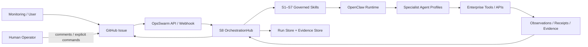
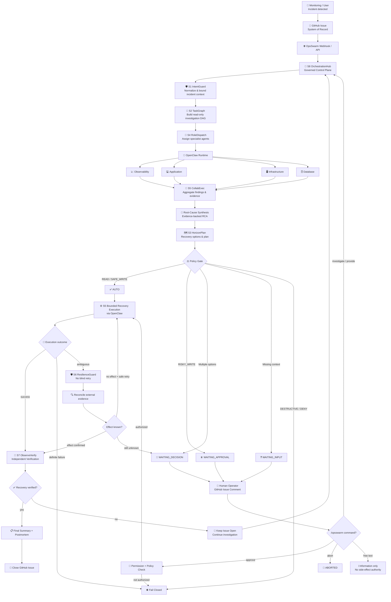

# OpsSwarm Enterprise

**Governed multi-agent incident response with OpenClaw as the AI runtime and GitHub Issues as the human control surface.**

OpsSwarm Enterprise coordinates incident investigation, recovery planning, human authorization, bounded execution, evidence capture, and independent verification through eight governed Skills (S1–S8). It is intentionally designed so that AI agents can reason and use tools, while OpsSwarm retains workflow authority, policy enforcement, state, evidence correlation, and terminal decisions.

## Architecture principles

The current architecture is built around these boundaries:

1. **OpenClaw is the only AI/agent runtime.**
2. **One GitHub Issue is the system of record for one incident.**
3. **GitHub Issue comments are the only human input/decision channel.**
4. **OpsSwarm S1–S8 form the governed control plane.**
5. **Investigation is read-only by default.**
6. **Agent recommendations are not execution authority.**
7. **Risky writes require an explicit authorized GitHub command.**
8. **Free-text comments never authorize side effects.**
9. **Ambiguous writes are never blindly retried.**
10. **S7 must independently verify recovery before the Issue can close.**



For the implementation-aligned architecture and trust boundaries, see [`docs/ARCHITECTURE.md`](docs/ARCHITECTURE.md). For runtime sequences and state transitions, see [`docs/FLOWS.md`](docs/FLOWS.md).

## Canonical incident lifecycle



The lifecycle diagram is intentionally icon-assisted for readability. The exact implemented runtime states are defined by `RunState` in `opsswarm/models.py` and documented in [`docs/FLOWS.md`](docs/FLOWS.md). The diagram does not introduce a separate `RECOVERING` state.

## S1–S8 Skill model

| Skill | Responsibility |
| --- | --- |
| **S1 IntentGuard** | Normalize the GitHub Issue into bounded incident context without inventing missing facts. |
| **S2 TaskGraph** | Build the minimum read-only investigation DAG using OBSERVE / INVESTIGATE / DIAGNOSE tasks. |
| **S3 HorizonPlan** | Produce evidence-supported remediation options and risk-aware recovery plans. |
| **S4 RoleDispatch** | Dispatch dependency-ready tasks to bounded OpenClaw specialist profiles. |
| **S5 CollabExec** | Aggregate structured evidence and execute only the selected/authorized recovery option. |
| **S6 ResilienceGuard** | Enforce fail-closed handling for policy gates, ambiguity, rejection, and human escalation. |
| **S7 ObserveVerify** | Independently verify service/business recovery using read-only evidence. |
| **S8 OrchestrationHub** | Own lifecycle, state transitions, cross-Skill ordering, GitHub synchronization, evidence correlation, and terminal outcome. |

Skill contracts are documented in [`skills/`](skills/) and validated by [`scripts/validate_skill.py`](scripts/validate_skill.py).

## OpenClaw agent profiles

The supplied OpenClaw configuration defines these profiles:

- `opsswarm-incident-manager`
- `opsswarm-observability-investigator`
- `opsswarm-application-investigator`
- `opsswarm-infrastructure-investigator`
- `opsswarm-database-investigator`
- `opsswarm-recovery-responder`
- `opsswarm-communications-postmortem`

Investigation profiles are intended to operate read-only. Recovery execution is bounded by OpsSwarm policy and explicit authorization rules.

## Human control through GitHub

Only explicit `/opsswarm` commands carry workflow authority:

```text
/opsswarm approve <option-id>
/opsswarm reject
/opsswarm investigate <request>
/opsswarm provide <information>
/opsswarm abort
/opsswarm resume
```

A comment such as `rollback looks fine` is stored as information only and **cannot** authorize a side effect.

Default authorization policy in `config/production.yaml`:

| Risk | Default policy |
| --- | --- |
| `read` | `AUTO` |
| `safe_write` | `AUTO` |
| `risky_write` | `HUMAN_APPROVAL` |
| `destructive` | `DENY` |

By default, input requires at least GitHub `read` permission, while approval/abort requires `maintain` permission.

## Requirements

- Python **3.11+**
- Git
- A GitHub repository with Issues enabled
- A GitHub token with permissions sufficient to read/write Issues and read collaborator permission for the target repository
- A publicly/reversibly reachable HTTPS endpoint for GitHub webhooks in non-local deployments
- OpenClaw installed and configured with a model provider
- Enterprise tools/APIs exposed to the appropriate OpenClaw profiles according to least privilege

## Quick start

### 1. Clone and create a Python environment

```bash
git clone https://github.com/vinhphan812/OpsSwarm-Enterprise.git
cd OpsSwarm-Enterprise

python -m venv .venv
source .venv/bin/activate
# Windows PowerShell: .venv\Scripts\Activate.ps1

python -m pip install --upgrade pip
pip install -e '.[dev]'
```

### 2. Prepare environment variables

```bash
cp .env.example .env
```

Edit `.env` and set at least:

```text
GITHUB_TOKEN=...
GITHUB_REPO=owner/repository
GITHUB_WEBHOOK_SECRET=...
OPSWARM_OPENCLAW_BIN=openclaw
OPSWARM_CONFIG=config/production.yaml
OPSWARM_DATA_DIR=runtime-data
```

The current runtime reads environment variables from the process environment; it does **not** automatically load `.env`. On a Unix-like shell you can load the file with:

```bash
set -a
source .env
set +a
```

For production, prefer your service manager, container runtime, or secret manager instead of storing production credentials in a shell-loaded file.

### 3. Install and configure OpenClaw

Install OpenClaw separately and configure/authenticate the model provider you intend to use. Initialize a baseline gateway:

```bash
openclaw setup --baseline
```

Edit `openclaw/openclaw.patch.json5` and replace every repository-path placeholder with the absolute path to this checkout, then validate and apply it:

```bash
openclaw config patch --file openclaw/openclaw.patch.json5 --dry-run
openclaw config patch --file openclaw/openclaw.patch.json5
openclaw config validate
openclaw gateway start
openclaw agents list
```

Optional profile smoke check:

```bash
openclaw agent \
  --agent opsswarm-observability-investigator \
  --message "Return only: OK" \
  --json
```

### 4. Run baseline tests

```bash
pytest -q
```

The repository includes a layered test suite (unit, integration, contracts, e2e, faults, security). See docs/index.md for the complete test structure.

### 5. Start OpsSwarm

```bash
export OPSWARM_CONFIG=config/production.yaml
uvicorn opsswarm.api:app --host 0.0.0.0 --port 8088
```

Health check:

```bash
curl http://localhost:8088/health
```

Expected shape:

```json
{"ok": true, "version": "2.1.0", "architecture": "openclaw+github"}
```

## GitHub webhook setup

Configure a repository webhook with:

```text
Payload URL:  https://<your-opsswarm-host>/webhooks/github
Content type: application/json
Secret:       same value as GITHUB_WEBHOOK_SECRET
Events:       Issues, Issue comments
```

OpsSwarm validates the GitHub webhook body with HMAC-SHA256 before accepting the event.

For a human-created incident, open an Issue using the supplied incident template and keep the required `opsswarm` label. An `issues.opened` webhook starts the governed run.

## Machine-created monitoring incidents

Monitoring systems can create normalized incidents through:

```text
POST /hooks/monitoring
```

Example:

```bash
curl -X POST http://localhost:8088/hooks/monitoring \
  -H 'Content-Type: application/json' \
  -d '{
    "title": "[SEV2] booking-api failures",
    "service": "booking-api",
    "symptom": "HTTP 5xx > 30%",
    "customer_impact": "customers cannot confirm bookings",
    "environment": "production",
    "severity_label": "sev:2"
  }'
```

OpsSwarm creates the GitHub Issue first and then starts the same Issue-centered orchestration flow.

## Runtime API

Current FastAPI endpoints include:

```text
GET  /health
GET  /runs
GET  /runs/{issue_number}
GET  /runs/{issue_number}/evidence
GET  /runs/{issue_number}/checkpoint
POST /runs/{issue_number}/resume
POST /webhooks/github
POST /hooks/monitoring
```

The runtime API is an operational interface; GitHub remains the user-visible incident system of record.

## Evidence and persistence

By default, machine-readable runtime data is stored under:

```text
runtime-data/runs/*.json
runtime-data/evidence/*.jsonl
```

The run store persists the current `RunRecord`; the evidence store appends structured provenance such as normalized incident context, task graphs, findings, root-cause artifacts, plans, human gates/approvals, execution results, and S7 verification.

Idempotency, concurrency, and crash-recovery semantics are documented in [`docs/adr/ADR-009-1_IDEMPOTENCY_STRATEGY.md`](docs/adr/ADR-009-1_IDEMPOTENCY_STRATEGY.md).

## Security and authority model

Key invariants:

- GitHub webhook signatures are verified.
- Human authority is derived from GitHub collaborator permission.
- Free-text comments never authorize side effects.
- Risky writes require explicit authorized approval.
- Destructive actions are denied by default even if a user attempts to approve them.
- Investigation prompts constrain specialist work to read-only scope.
- OpenClaw output is validated into typed Pydantic artifacts before use.
- Ambiguous write outcomes are not blindly retried.
- S7 independently verifies recovery; executor success is context, not proof.
- Failed or unverified recovery leaves the Issue open.

For production deployments, also apply OpenClaw sandbox/tool allowlists and least-privilege credentials for every specialist profile, especially the recovery responder.

See [`docs/SECURITY.md`](docs/SECURITY.md).

## Testing and quality status

Run the full test suite with:

```bash
pytest -q
```

See [`docs/index.md`](docs/index.md) for the complete test structure and quality gates.

## Repository layout

```
OpsSwarm-Enterprise/
├── opsswarm/                  # governed Python runtime
├── skills/                   # S1–S8 Skill definitions (ADR-011)
├── openclaw/                  # OpenClaw patch and specialist workspaces
├── config/                   # test/production configuration
├── docs/                     # architecture, flows, installation, operations, security
│   ├── adr/                 # architecture decision records
│   ├── guides/              # operational guides and contracts
│   ├── triage/             # issue triage and gap analysis
│   └── audits/              # documentation and security audits
├── tests/                    # layered test suite (unit/integration/contract/e2e/faults/security)
├── scripts/                  # helper scripts (validate_skill.py, smoke-wheel.py)
├── deploy/                   # deployment assets
├── .github/                  # Issue templates and CI workflows
├── pyproject.toml
├── Makefile
└── LICENSE
```

## Documentation

| Document | Description |
|---|---|
| [`docs/index.md`](docs/index.md) | **Main documentation entry point.** Navigation hub for all docs. |
| [`docs/ARCHITECTURE.md`](docs/ARCHITECTURE.md) | System context, S1–S8 responsibility map, authority, evidence, trust boundaries, invariants. |
| [`docs/FLOWS.md`](docs/FLOWS.md) | End-to-end sequences, exact runtime state machine, human gates, ambiguous-write handling. |
| [`docs/INSTALLATION.md`](docs/INSTALLATION.md) | Installation and OpenClaw/GitHub setup. |
| [`docs/OPERATIONS.md`](docs/OPERATIONS.md) | Human/machine incident operation. |
| [`docs/SECURITY.md`](docs/SECURITY.md) | Security and authority model. |
| [`docs/adr/README.md`](docs/adr/README.md) | Index of all architectural decision records. |
| [`openclaw/README.md`](openclaw/README.md) | OpenClaw-specific configuration notes. |

## Current limitations

- Persistence is currently file-based rather than a transactional database.
- Restart/resume behavior has not been proven for every state/fault combination.
- External enterprise tool behavior depends on the capabilities and credentials configured for each OpenClaw profile.

## License

OpsSwarm Enterprise is released under the **MIT License**. See [`LICENSE`](LICENSE).

The MIT license applies to the original project material covered by this repository's license. Third-party libraries, tools, generated integrations, or vendored materials remain subject to their respective licenses and notices.

Copyright (c) 2026 Phan Thanh Vinh.
