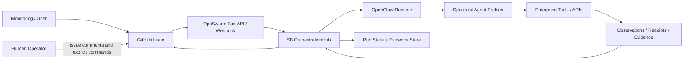
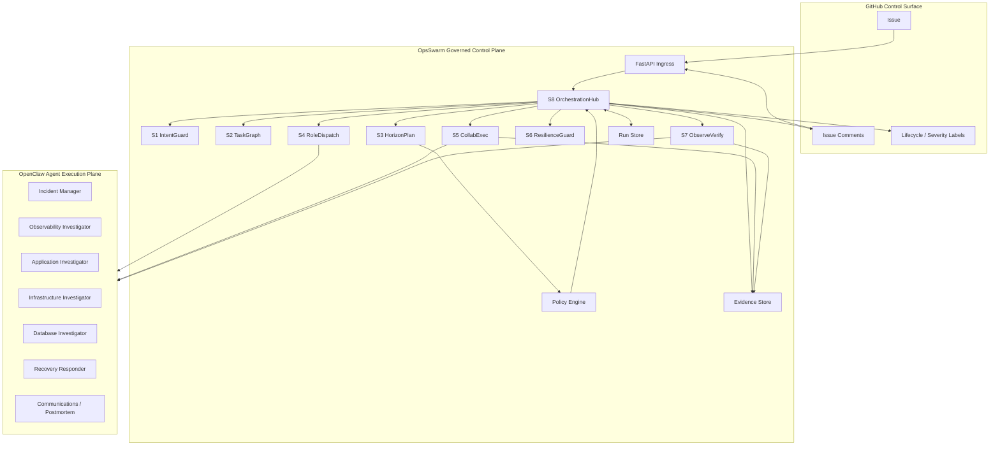
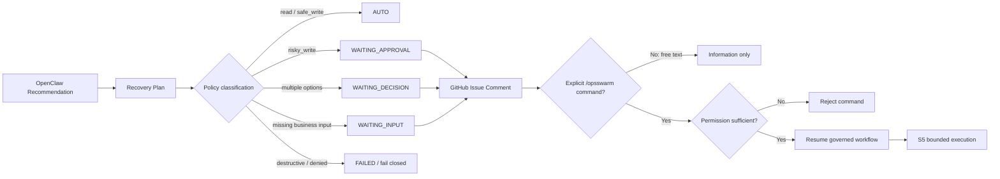
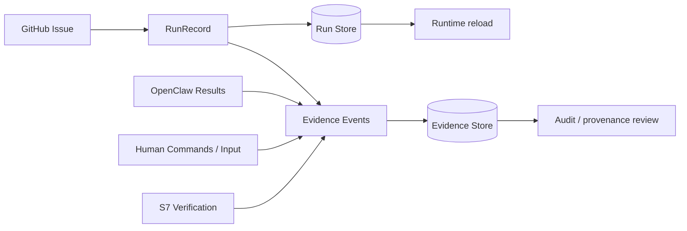
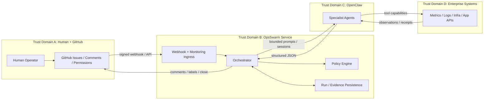

# OpsSwarm Enterprise Architecture

OpsSwarm Enterprise is a governed incident-response control plane built around three explicit boundaries:

1. **GitHub Issues are the incident system of record and the only human decision/input surface.**
2. **OpenClaw is the only AI/agent runtime.**
3. **OpsSwarm owns workflow authority, policy gates, state, evidence correlation, and terminal lifecycle decisions.**

This document describes the architecture that exists in the current codebase. Where a capability is an architectural
Skill rather than a one-to-one Python class/function, that distinction is called out explicitly.

## 1. Architecture goals

OpsSwarm is designed to:

- turn one incident into one governed run with traceable evidence;
- keep investigation read-only until diagnosis and planning are sufficiently grounded;
- delegate bounded reasoning and tool use to specialist OpenClaw agents;
- separate AI recommendations from execution authority;
- require explicit human authorization for risky writes;
- prevent free-text comments from becoming side-effect authority;
- preserve evidence for every important decision and external action;
- require independent recovery verification before issue closure;
- fail closed when confidence, authority, or write outcome is ambiguous.

### Non-goals

The current architecture does **not**:

- treat OpenClaw agent output as authority by itself;
- allow arbitrary free-text comments to approve production changes;
- permit destructive actions merely because a human approves them if policy denies them;
- close an incident based only on an executor's claim of success;
- claim a dedicated `RECOVERING` runtime state that does not exist in `RunState` today;
- guarantee distributed/multi-process idempotency beyond the mechanisms implemented in the current runtime. Reliability
  hardening is tracked separately.

## 2. Frozen architecture decisions

1. OpenClaw is the only AI/agent runtime.
2. GitHub Issues are the incident system of record.
3. GitHub Issue comments are the only human input/decision channel.
4. One incident maps to one GitHub Issue and one OpsSwarm run.
5. Investigation is read-only by default.
6. Side effects require policy authorization; risky writes require an explicit `/opsswarm approve <option-id>` command.
7. Free text is information only and never authorization.
8. S7 independently verifies recovery before the issue may close.
9. Ambiguous writes are never blindly retried.
10. Destructive actions remain denied when policy classifies them as `DENY`, even if a user attempts to approve them.

## 3. System context



### External systems

- **GitHub** provides Issues, labels, comments, user permission lookup, issue creation, and issue closure.
- **OpenClaw** provides bounded AI reasoning/execution sessions for the configured specialist profiles.
- **Enterprise tools/APIs** are reached through OpenClaw capabilities available to each profile. OpsSwarm does not treat
  tool access as implicit authority; the workflow and policy layer still determine when a side-effecting recovery action
  may be attempted.

## 4. High-level component architecture



The diagram is architectural, not a claim that every Skill is implemented by a separate class. In the current Python
implementation, orchestration is concentrated in `opsswarm/orchestrator.py`, while model validation and OpenClaw prompt
contracts live in `opsswarm/models.py`, `opsswarm/skill_logic.py`, and `opsswarm/prompts.py`.

## 5. Control plane vs agent execution plane

### OpsSwarm control plane

OpsSwarm owns:

- the mapping between an Issue and a run;
- runtime state transitions;
- task dependency scheduling;
- selection of OpenClaw profiles;
- policy classification of recovery options;
- human gates and permission checks;
- persistence of run state and evidence;
- handling of explicit `/opsswarm` commands;
- independent verification thresholds;
- issue lifecycle labels and final closure.

### OpenClaw execution plane

OpenClaw agents provide bounded domain reasoning and tool interaction. The configured profiles are:

- `incident-manager`
- `observability-investigator`
- `application-investigator`
- `infrastructure-investigator`
- `database-investigator`
- `recovery-responder`
- `communications-postmortem`

An agent response is always data returned to the control plane. It can become a finding, root-cause artifact, recovery
plan, execution result, or verification result, but it does not bypass OpsSwarm state, policy, or human authorization.

## 6. S1-S8 responsibility map

| Skill                   | Architectural responsibility                                                                                                    | Current implementation mapping                                                                                                                      |
|-------------------------|---------------------------------------------------------------------------------------------------------------------------------|-----------------------------------------------------------------------------------------------------------------------------------------------------|
| **S1 IntentGuard**      | Normalize a GitHub Issue into bounded incident context without inventing missing facts.                                         | `skill_logic.parse_issue()` + `IncidentContext`.                                                                                                    |
| **S2 TaskGraph**        | Create the minimum read-only investigation DAG using OBSERVE / INVESTIGATE / DIAGNOSE tasks.                                    | `build_tasks()`, `make_extra_task()`, task graph checks in `_investigate()`.                                                                        |
| **S3 HorizonPlan**      | Produce evidence-supported remediation options and classify their operational risk inputs.                                      | `make_recovery_plan()` + `RecoveryPlan`; policy classification follows in `_plan()`.                                                                |
| **S4 RoleDispatch**     | Map investigation tasks to allowed specialist OpenClaw profiles and execute dependency-ready work in waves.                     | Profile selection and dispatch loop in `_investigate()` + `execute_task()`.                                                                         |
| **S5 CollabExec**       | Aggregate structured findings and execute only the selected/authorized recovery action, preserving receipts/evidence.           | Findings are accumulated by the orchestrator; recovery execution uses `execute_recovery()` and stores `S5.execution`.                               |
| **S6 ResilienceGuard**  | Enforce fail-closed handling of ambiguity, policy gates, rejection, bounded continuation, and human escalation.                 | Distributed across `PolicyEngine`, `_plan()`, `_execute_option()`, and `handle_comment()`. There is currently no separate `RECOVERING` state/class. |
| **S7 ObserveVerify**    | Independently verify business/service recovery using read-only evidence; executor success is context, not proof.                | `verify_recovery()` + `_verify()` and configured confidence threshold.                                                                              |
| **S8 OrchestrationHub** | Own the incident lifecycle, state transitions, checkpoints, cross-Skill ordering, GitHub synchronization, and terminal outcome. | `Orchestrator`.                                                                                                                                     |

### Task taxonomy

Before remediation, S2 may create only:

- `OBSERVE`
- `INVESTIGATE`
- `DIAGNOSE`

`REMEDIATE` is represented by the selected recovery option after diagnosis/planning and policy authorization. `VERIFY`
is always logically independent from the recovery executor and is performed using the observability profile.

## 7. GitHub as system of record and human control surface

A GitHub Issue is the user-visible record for one incident. The Issue carries:

- incident description and context;
- severity/lifecycle labels;
- investigation and diagnosis comments;
- decision/approval requests;
- explicit operator commands;
- final recovery summary and postmortem;
- closure only after S7 verification.

Machine-readable runtime state and evidence are persisted locally under the configured OpsSwarm data directory. GitHub
remains the collaborative human-facing system of record; local run/evidence files provide structured provenance.

## 8. Human authority and policy boundary



The command parser is deliberately narrow. Only explicit `/opsswarm ...` commands carry authority. The primary commands
are:

```text
/opsswarm approve <option-id>
/opsswarm reject
/opsswarm investigate <request>
/opsswarm provide <information>
/opsswarm abort
/opsswarm resume
```

Free-text comments are stored as human input with `authority: information-only`; they never authorize a side effect.

## 9. Evidence and persistence model

Two persistence concerns are intentionally separated:

- **Run Store** persists the current `RunRecord`, including state, incident context, tasks, findings, root-cause
  artifact, recovery plan, decision, execution result, verification result, human inputs, and error state.
- **Evidence Store** appends machine-readable events such as S1 incident normalization, S2 task graph, S4 findings,
  root-cause synthesis, S3 recovery plan, human gate/approval events, S5 execution, and S7 verification.



Current startup behavior reloads persisted run records into the orchestrator. Idempotency, concurrency, and restart semantics are documented in [`ADR-009-1`](./adr/ADR-009-1_IDEMPOTENCY_STRATEGY.md) and [`ADR-012`](./adr/ADR-012_COMMAND_OUTCOME_MODEL.md).

## 10. Trust boundaries and interfaces



### Boundary rules

- GitHub webhook requests must pass signature verification.
- GitHub user permissions are checked before authoritative commands are accepted.
- OpenClaw output is schema-validated through Pydantic models before use.
- A policy decision can block a human-approved option if the option is classified as denied.
- A lost/ambiguous side-effect result is not automatically retried.
- S7 performs an independent read-only verification pass before terminal success.

## 11. Failure isolation and recovery principles

OpsSwarm follows these principles:

1. **Read first.** Investigation tasks are read-only and scoped to a bounded objective.
2. **Do not guess business facts.** Missing business/operational knowledge routes to `WAITING_INPUT`.
3. **Separate recommendation from authority.** Agent proposals are evaluated by policy and, when needed, explicit human
   commands.
4. **No blind retry after ambiguous writes.** Ambiguity routes to `WAITING_DECISION` so operators can request read-only
   reconciliation, abort, or resume from a safe checkpoint.
5. **Independent verification.** Executor success alone cannot resolve the incident.
6. **Fail closed.** Failed execution, denied remediation, or insufficient verification results in an open/failed
   incident rather than a false success.

## 12. Runtime state model

The canonical runtime states are defined by `RunState` in `opsswarm/models.py`:

```text
OPEN
TRIAGE
INVESTIGATING
DIAGNOSED
PLANNING
EXECUTING
VERIFYING
WAITING_APPROVAL
WAITING_DECISION
WAITING_INPUT
RESOLVED
FAILED
ABORTED
```

The detailed state-transition diagram and end-to-end sequences are maintained in [FLOWS.md](./FLOWS.md). Diagrams must
use these exact implemented state names.

## 13. Architecture invariants

The following invariants are normative for the current architecture:

- **A1 — Correlation:** one incident Issue maps to one active OpsSwarm run.
- **A2 — Read-only investigation:** pre-remediation investigation tasks are read-only.
- **A3 — Explicit authority:** free-text comments never authorize side effects.
- **A4 — Permission enforcement:** authoritative `/opsswarm` commands require the configured GitHub permission level.
- **A5 — Policy precedence:** a human approval cannot override a policy `DENY` for a destructive option.
- **A6 — No blind ambiguous retry:** an ambiguous write result transitions to human decision/reconciliation rather than
  immediate repetition.
- **A7 — Evidence-backed execution:** findings, plans, execution, approvals, and verification are persisted as
  structured artifacts/events.
- **A8 — Independent verification:** S7 does not accept the recovery executor's success claim as proof.
- **A9 — Verified close only:** the GitHub Issue closes only after S7 returns `verified=true` at or above the configured
  confidence threshold.
- **A10 — Traceability:** every external recovery action is correlated with a run and Issue context.
- **A11 — Terminal safety:** `FAILED` and `ABORTED` never cause automatic issue closure.
- **A12 — No invented implementation:** architecture documentation must distinguish implemented behavior from planned extensions.

## 14. Implementation map

| Concern                          | Primary source              |
|----------------------------------|-----------------------------|
| HTTP/webhook/monitoring ingress  | `opsswarm/api.py`           |
| Runtime state and domain models  | `opsswarm/models.py`        |
| Orchestration and human commands | `opsswarm/orchestrator.py`  |
| Policy classification            | `opsswarm/policy.py`        |
| Skill/OpenClaw calls             | `opsswarm/skill_logic.py`   |
| Agent contracts/prompts          | `opsswarm/prompts.py`       |
| GitHub API boundary              | `opsswarm/github_client.py` |
| OpenClaw boundary                | `opsswarm/openclaw.py`      |
| Run persistence                  | `opsswarm/store.py`         |
| Evidence persistence             | `opsswarm/evidence.py`      |
| Webhook signature verification   | `opsswarm/webhook.py`       |

## 15. Related documentation and hardening work

- [End-to-end flows](./FLOWS.md)
- [Operations guide](./OPERATIONS.md)
- [Installation guide](./INSTALLATION.md)
- [Security guide](./SECURITY.md)
- Issue #9 — persistence, idempotency, concurrency, and restart recovery hardening
- Issue #10 — architecture documentation with Mermaid diagrams
- Issue #11 — end-to-end lifecycle and recovery-flow documentation

Any future architecture-significant change should update this document, the corresponding flow diagram, tests/fitness
gates, and an ADR when the project ADR process is established.