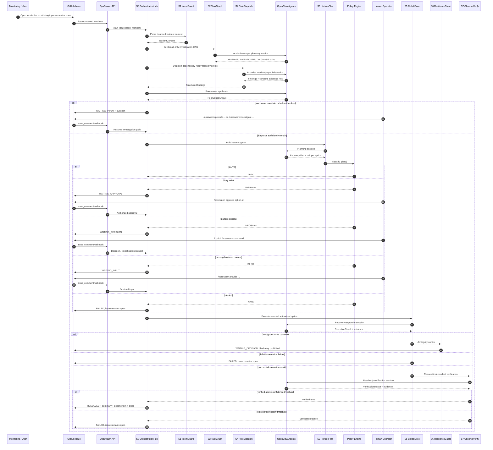
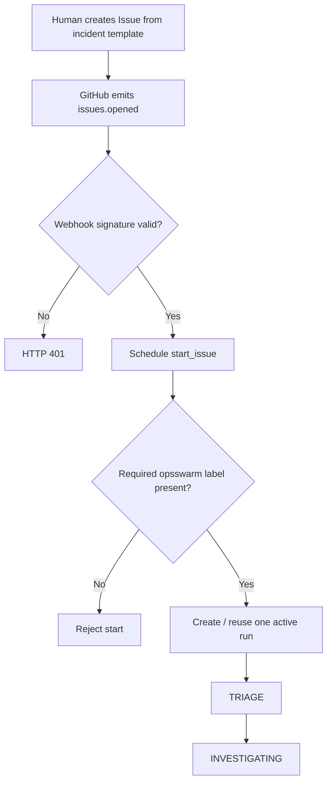
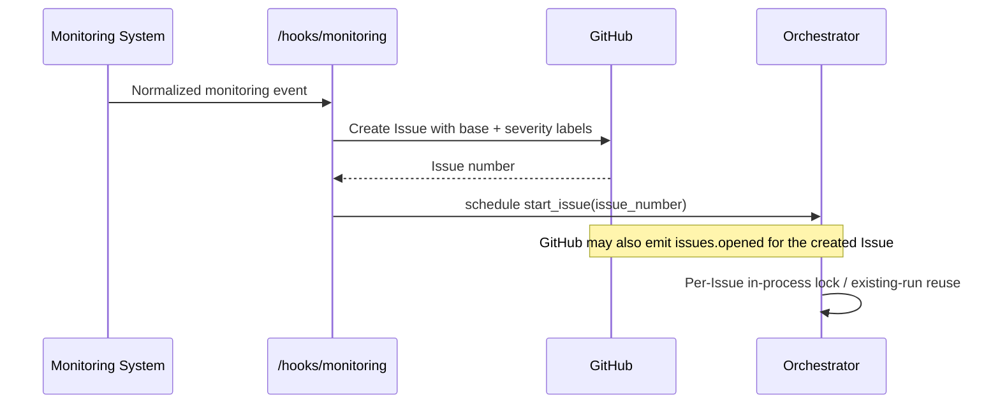
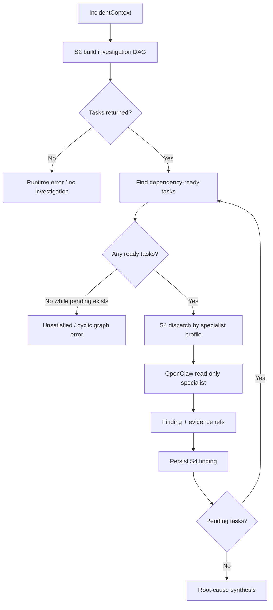
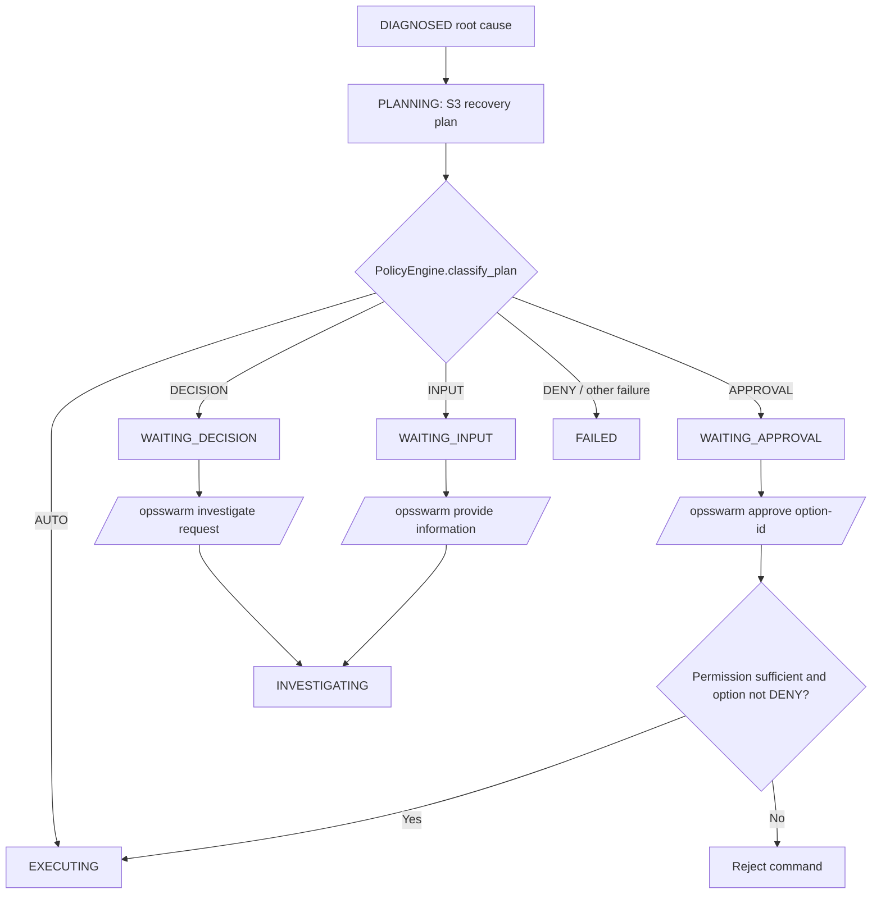
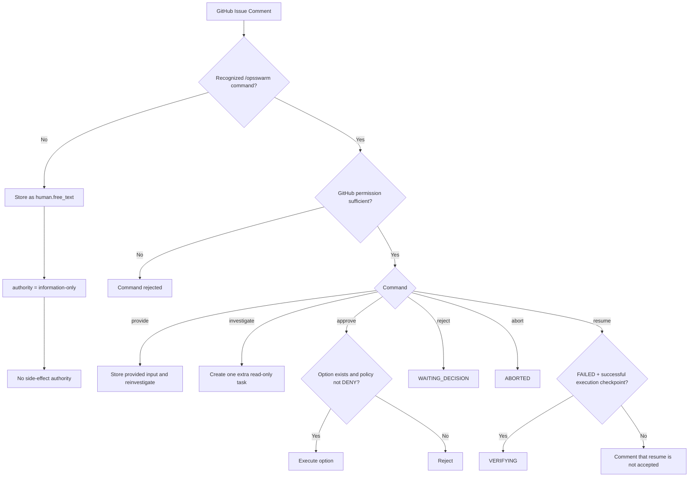
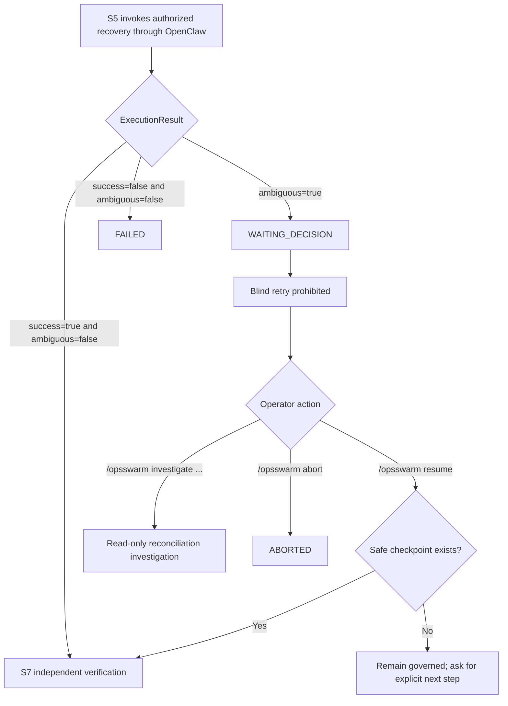
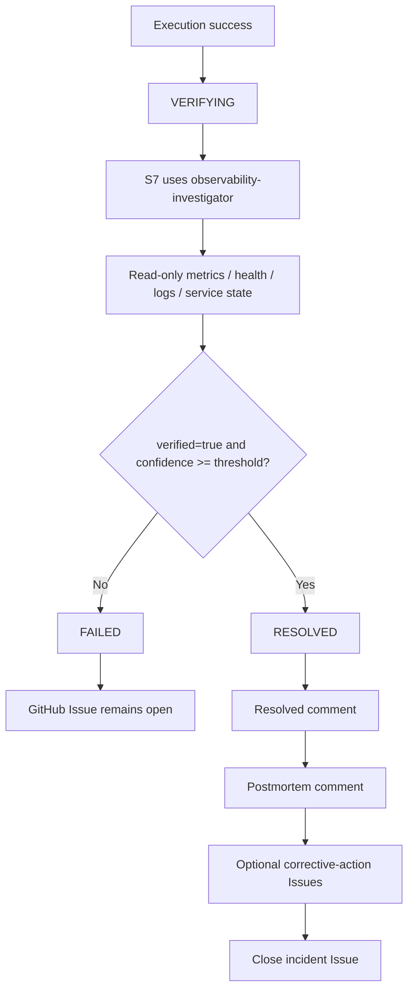
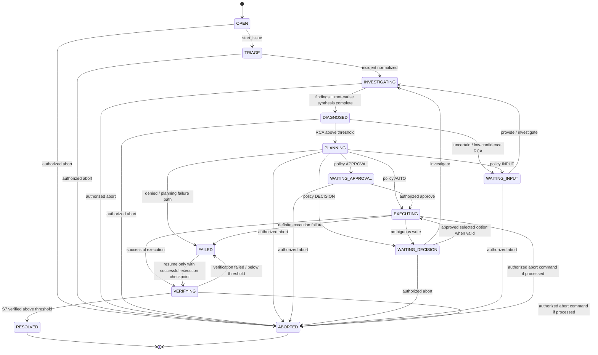

# OpsSwarm Enterprise Runtime Flows

This document describes the **implemented v2.1 runtime flow** used as the baseline for v2.2 quality hardening. It complements [ARCHITECTURE.md](./ARCHITECTURE.md) by showing event ordering, state transitions, human gates, evidence production, and failure branches.

A core rule for this document is: **the diagrams follow production code, not an aspirational design**. Runtime state names therefore match `RunState` in `opsswarm/models.py` exactly.

## 1. Canonical flow at a glance

```text
Monitoring/User
    -> GitHub Issue
    -> OpsSwarm webhook / monitoring ingress
    -> S8 lifecycle control
    -> S1 incident normalization
    -> S2 read-only investigation DAG
    -> S4 specialist OpenClaw dispatch
    -> structured findings + evidence
    -> root-cause synthesis
    -> S3 recovery planning
    -> policy
       -> AUTO, or
       -> WAITING_APPROVAL, or
       -> WAITING_DECISION, or
       -> WAITING_INPUT, or
       -> FAILED
    -> S5 authorized recovery execution
    -> S6 ambiguity / resilience control when required
    -> S7 independent verification
    -> RESOLVED + final comments + issue close
       OR
       FAILED / ABORTED with issue left open
```

The Skill labels above are architectural capabilities. The current implementation concentrates orchestration in `opsswarm/orchestrator.py` and delegates structured OpenClaw calls through `opsswarm/skill_logic.py`.

## 2. Canonical end-to-end sequence



### Important implementation note

S6 is currently an **architectural resilience capability**, not a standalone runtime object/state. Its behavior is implemented by policy/orchestrator branches such as ambiguous-write handling, fail-closed decisions, human gates, and safe continuation. There is no `RECOVERING` member in `RunState` today.

## 3. Human-created incident flow

Trigger: GitHub `issues.opened` webhook.



### Inputs

- Issue number/title/body
- labels, including the required OpsSwarm label
- Issue author
- structured incident-template fields such as service, symptoms, customer impact, and environment

### Evidence

S1 persists `S1.incident`. The Issue remains the human-visible system of record.

### Duplicate start behavior

Within one process, `start_issue()` uses a per-Issue asyncio lock and reuses an existing non-failed/non-aborted run. Persisted runs are loaded at startup. Stronger GitHub delivery-ID deduplication and cross-process idempotency are **not claimed here** and are tracked by reliability hardening work.

## 4. Machine-created monitoring incident flow

Trigger: `POST /hooks/monitoring`.



The machine-created path intentionally converges on the same GitHub Issue and the same `start_issue()` workflow as human-created incidents.

## 5. Investigation and evidence-gathering flow

S2 creates only read-only work before remediation. The allowed task types are `OBSERVE`, `INVESTIGATE`, and `DIAGNOSE`.



### Parallelism

Dependency-ready tasks are executed in waves with `asyncio.gather`. A task enters `RUNNING`, then `DONE` on success or `FAILED` on exception.

### Root-cause gate

After all investigation tasks finish, the incident-manager profile synthesizes a `RootCauseArtifact`.

- if `status=uncertain`, or confidence is below `root_cause_confidence_threshold`, the run moves to `WAITING_INPUT`;
- otherwise it moves through `DIAGNOSED` to planning.

## 6. Recovery planning and policy flow



### Safe automatic path

If policy returns `AUTO`, the current implementation selects the first recovery option and calls the recovery executor without a human approval step.

### Risky-write approval path

For `APPROVAL`, the run transitions to `WAITING_APPROVAL`. Only an explicit `/opsswarm approve <option-id>` from a user at or above the configured minimum permission can continue to execution.

### Decision path

For multiple materially different options or ambiguity, the run is placed in `WAITING_DECISION`. Human operators can request additional read-only investigation or provide explicit information/commands.

### Missing-input path

`WAITING_INPUT` is used when diagnosis/planning lacks business or operational context. `/opsswarm provide ...` stores the supplied information and re-enters investigation/root-cause synthesis.

## 7. Human command authority flow



### Current state-guard nuance

The current handler strongly enforces **permissions and policy**, but not every command has an explicit state whitelist before it is processed. The diagrams show the intended operational use of commands from the relevant waiting states while documenting the current implementation truth. Tightening command/state guards belongs to v2.2 reliability hardening rather than being silently claimed as already implemented.

## 8. Side-effect execution and ambiguous-write flow



The recovery prompt itself instructs the OpenClaw recovery responder to preserve idempotency where supported and not blindly repeat an operation when transport becomes ambiguous after a write.

## 9. Independent verification and closure



S7 receives the execution result only as context. The verification prompt explicitly states that executor success is **not proof**.

## 10. Implemented state machine

The exact runtime states are:

```text
OPEN
TRIAGE
INVESTIGATING
DIAGNOSED
PLANNING
EXECUTING
VERIFYING
WAITING_APPROVAL
WAITING_DECISION
WAITING_INPUT
RESOLVED
FAILED
ABORTED
```

The transitions used by the implemented control flow are summarized below.



### State-machine caveat

`RunRecord.transition()` currently assigns a new state without an explicit transition table. The orchestrator determines valid operational sequencing. Strengthening state monotonicity/transition guards is part of reliability hardening and should be tested rather than assumed.

## 11. Failure and resume matrix

| Condition | Current state/result | Human-visible behavior | Evidence / next step |
| --- | --- | --- | --- |
| Required Issue label missing | start rejected | no governed run starts | correct Issue labels |
| S2 returns no tasks | runtime error | incident cannot progress | investigate orchestration failure |
| Task graph cannot make progress | runtime error | incident cannot progress | graph is unsatisfied/cyclic |
| RCA uncertain / low confidence | `WAITING_INPUT` | decision-request comment | provide context or request more investigation |
| Policy needs risky-write approval | `WAITING_APPROVAL` | approval request | `/opsswarm approve <option-id>` |
| Multiple options | `WAITING_DECISION` | decision request | explicit command / more investigation |
| Missing business constraint | `WAITING_INPUT` | question | `/opsswarm provide ...` |
| Policy denies plan | `FAILED` | failure comment | issue stays open |
| Write outcome ambiguous | `WAITING_DECISION` | blind-retry warning | reconcile/read/abort/safe resume |
| Recovery definite failure | `FAILED` | recovery-failed comment | issue stays open |
| S7 verification fails | `FAILED` | verification-failed comment | issue stays open |
| S7 verification succeeds | `RESOLVED` | summary + postmortem | issue closes |
| Authorized abort | `ABORTED` | aborted comment | issue stays open |

## 12. Evidence produced by the flow

The current orchestrator writes machine-readable evidence events including:

- `S1.incident`
- `S2.task_graph`
- `S4.finding`
- `RCA.root_cause`
- `S3.recovery_plan`
- `S6.human_gate`
- `human.free_text`
- `human.input`
- `human.approval`
- `S5.execution`
- `S7.verification`

Runtime storage locations are documented in [OPERATIONS.md](./OPERATIONS.md). These events complement the GitHub Issue, which remains the user-visible incident record.

## 13. Flow-to-code map

| Flow | Primary implementation |
| --- | --- |
| GitHub webhook ingress | `opsswarm/api.py::github_webhook` |
| Monitoring ingress | `opsswarm/api.py::monitoring_event` |
| Start / correlation | `Orchestrator.start_issue` |
| Investigation DAG | `Orchestrator._investigate`, `skill_logic.build_tasks` |
| Specialist dispatch | `_investigate`, `skill_logic.execute_task` |
| Root-cause synthesis | `skill_logic.synthesize_root_cause` |
| Recovery planning | `Orchestrator._plan`, `skill_logic.make_recovery_plan` |
| Policy | `PolicyEngine.classify_plan` |
| Recovery execution | `Orchestrator._execute_option`, `skill_logic.execute_recovery` |
| Verification | `Orchestrator._verify`, `skill_logic.verify_recovery` |
| Human comments/commands | `Orchestrator.handle_comment`, `commands.parse_command` |
| State definitions | `opsswarm/models.py::RunState` |

## 14. Documentation consistency rules

When runtime behavior changes, update this document in the same PR if the change affects:

- a `RunState` transition;
- a human command or authority boundary;
- a Skill handoff;
- a policy classification branch;
- the definition of successful recovery;
- evidence events;
- GitHub/OpenClaw trust boundaries.

New diagrams must distinguish **implemented behavior** from **planned hardening**. In particular, do not add a `RECOVERING` runtime state or claim distributed idempotency unless production code implements and tests it.

## 15. Related documents

- [Architecture](./ARCHITECTURE.md)
- [Operations](./OPERATIONS.md)
- [Security](./SECURITY.md)
- [Installation](./INSTALLATION.md)
- Issue #9 — persistence/idempotency/concurrency/restart hardening
- Issue #10 — architecture documentation
- Issue #11 — runtime flow documentation
